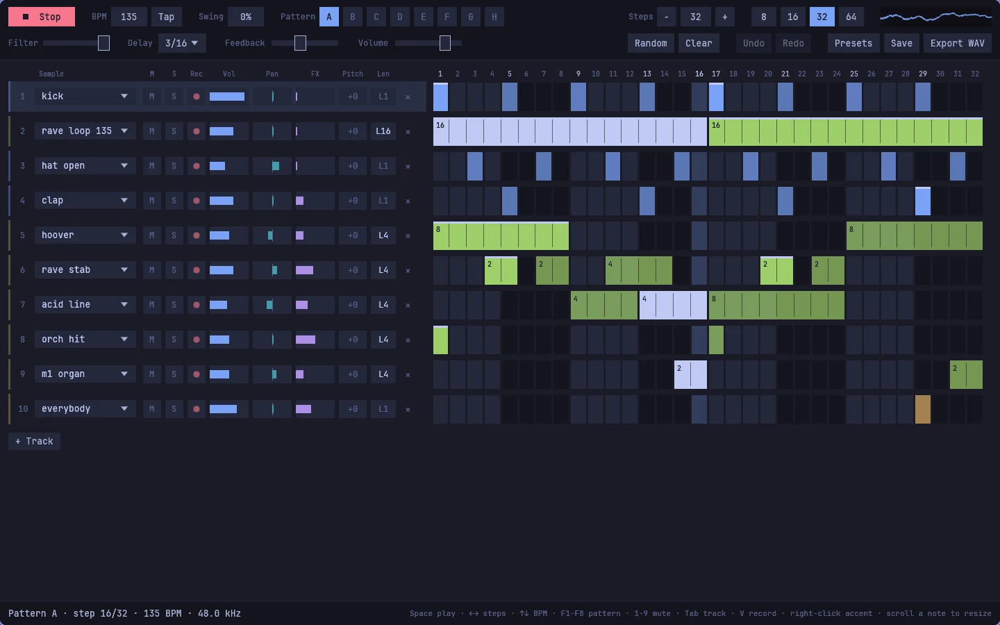
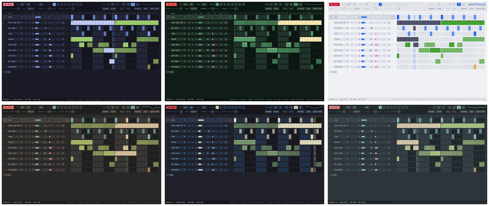
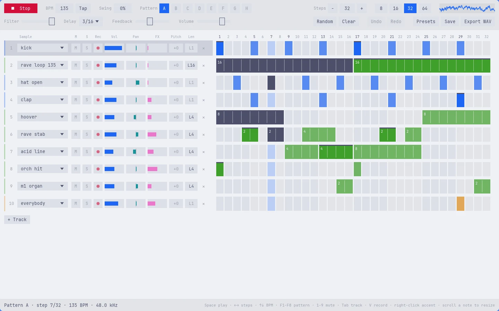

# Sequencer

A step sequencer for [Omarchy](https://omarchy.org). Draw a beat on the grid, stretch notes over as many steps as you like, switch between eight patterns while it plays, and record your own sounds from the microphone. It comes with a TR-808 kit, riffs, 90s rave stabs and vocals, all public domain.



Open the app and press **Space**. The demo beat starts, and everything you change is heard on the next step. When you like it, **Export WAV** writes four loops of the pattern to `~/Music`. Everything takes the colours and the font of your Omarchy theme.

Built for Omarchy on Hyprland (Rust, egui and cpal, with audio through PipeWire).

## Install

```bash
git clone https://github.com/jankeesvw/sequencer.git ~/Documents/github.com/jankeesvw/sequencer
cd ~/Documents/github.com/jankeesvw/sequencer
./install.sh
```

[install.sh](install.sh) builds a release with cargo, puts the binary in `~/.local/bin/sequencer`, and installs a desktop entry and icon, so **Sequencer** shows up in the launcher (Super + Space). Removing it is deleting those three files.

## What it does

### Draws a beat in a few clicks

Click or drag over the grid to draw notes, click a note to erase it, and right-click for an accent (louder, with a bright edge). The grid runs from 1 to 64 steps and up to 16 tracks, and the rows and cells grow with the window.

### Lets notes last as long as you want

Every track has a length button (`L1`, `L2`, `L4`, `L8`, `L16`) for the notes you draw next. A long note is one bar across the steps it covers and sounds exactly that long, so a riff, a hoover or a whole loop plays out and stops where the bar ends. Scroll over a note to make it longer or shorter. Drums start at one step, riffs at a beat and loops at a bar.

### Plays eight patterns

The letters A to H are eight patterns with their own notes and length. While it plays, picking another pattern waits for the end of the bar, so the switch is always on time. Shift-click (or right-click) a letter to copy the current pattern there as a starting point.

### Mixes every track

Each track has mute, solo, volume, pan, a send to the delay and pitch in semitones. On the master there is swing, a lowpass filter for sweeps, a ping-pong delay in step with the tempo, and tap tempo.

### Records your own sounds

Hold the red button on a track, or hold `V` for the selected track, and make a sound. It works like [Voxtype](https://github.com/peteonrails/voxtype): the microphone is only open while you hold, and when you let go the silence is trimmed, the level is evened out and the recording goes straight onto that track. Every recording is saved as `rec_01.wav`, `rec_02.wav` and so on in `~/.local/share/sequencer/samples`, next to any `.wav` files of your own.

### Wears your Omarchy theme

The app reads the palette of the current theme (`colors.toml`) and uses the system monospace font. Every kind of sound gets one of the theme's colours: drums the accent, riffs magenta, rave green, vocals yellow and your own recordings cyan. Switch themes while it is open and it follows.





## Keys

| Key | What it does |
|---|---|
| `Space` | Play or stop |
| `←` `→` | Fewer or more steps |
| `↑` `↓` | Tempo down or up, `T` to tap it |
| `F1` to `F8` | Pattern A to H, with `Shift` to copy the current pattern there |
| `1` to `9` | Mute track 1 to 9 |
| `Tab`, `Shift+Tab` | Select the next or previous track |
| `V` (hold) | Record into the selected track |
| `R`, `C`, `N` | Random pattern, clear the pattern, add a track |
| `Ctrl+Z`, `Ctrl+Shift+Z` | Undo, redo |
| `Ctrl+S`, `Ctrl+E` | Save, export WAV |

## Command line

| Command | What it does |
|---|---|
| `sequencer` | Open the sequencer with your last song |
| `sequencer --play` | Start playing right away |
| `sequencer --preset demo` | Start from the demo beat instead of your song |
| `sequencer --preset rave` | Start from the 135 BPM rave preset |

## What it writes to disk

| Path | What |
|---|---|
| `~/.config/sequencer/song.json` | Your song, saved a few seconds after every change and when you quit |
| `~/.local/share/sequencer/samples/` | Your recordings and your own `.wav` samples |
| `~/Music/sequencer-<pattern>-<bpm>bpm-<nn>.wav` | Exports |

## Handy to know

- A floating window suits it. Add this to `~/.config/hypr/windows.lua`:

  ```lua
  o.window("^sequencer$", { float = true })
  o.window("^sequencer$", { size = { 1440, 900 } })
  o.window("^sequencer$", { center = true })
  ```

- Sequencer plays to your default output and records from your default input; pick them in the Omarchy audio menu.
- Without a sound card it keeps running silently, so the grid still works.

## Requirements

Omarchy (or another Wayland desktop with PipeWire), `fc-match` from fontconfig, and a Rust toolchain to build.

## Samples

All bundled samples are CC0 (public domain), converted to 44.1 kHz mono and embedded in the binary.

- Drums: the Roland TR-808 Sound Sample Set by Michael Fischer (1994), via [tidalcycles/sounds-tr808-fischer](https://github.com/tidalcycles/sounds-tr808-fischer).
- Riffs and stabs: "2HTC Samples Vol 4 Addendum" by Ben Burnes (Abstraction Music), via [lavenderdotpet/CC0-Public-Domain-Sounds](https://github.com/lavenderdotpet/CC0-Public-Domain-Sounds).
- 90s rave, real recordings from Freesound: rave stab ([443931](https://freesound.org/s/443931/)), Roland JX-3P stab by modularsamples ([307131](https://freesound.org/s/307131/)), hoover by Chameon ([399542](https://freesound.org/s/399542/)), hardhouse hoover by woowah ([11512](https://freesound.org/s/11512/)), mentasm by sandizzy ([25393](https://freesound.org/s/25393/)), M1 organ by Cloud-10 ([680995](https://freesound.org/s/680995/)), orchestra hit by BigDumbWeirdo ([90741](https://freesound.org/s/90741/)), acid line by makenoisemusic ([402949](https://freesound.org/s/402949/)), acid bass by evanjones4 ([243999](https://freesound.org/s/243999/)), house chords by Slanted ([510229](https://freesound.org/s/510229/)), and rave loops by Alastair_Pursloe ([183441](https://freesound.org/s/183441/)) and GENERALMiDiGUy ([490703](https://freesound.org/s/490703/)).
- Vocals: dance shouts, soulful house vocals and computer voices from the [Producer Space CC0 library](https://archive.org/details/producer-space-cc0-sample-library).

## License

MIT for the code. The samples are CC0, see above.
