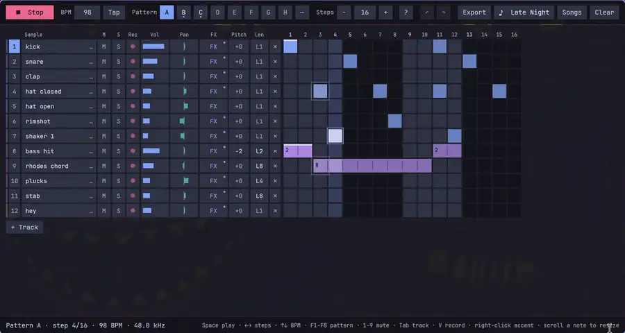
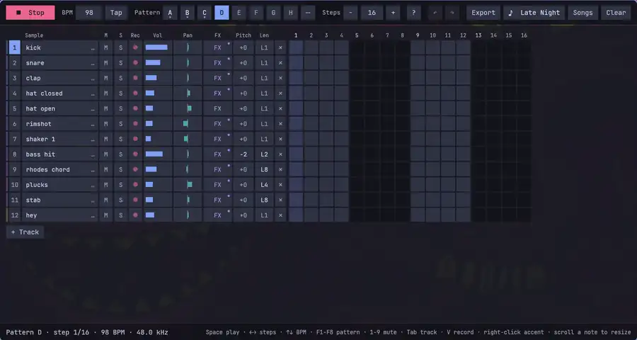
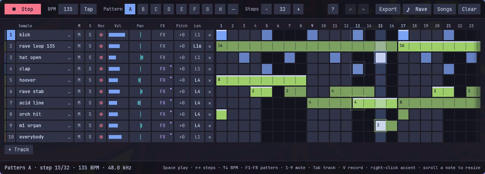
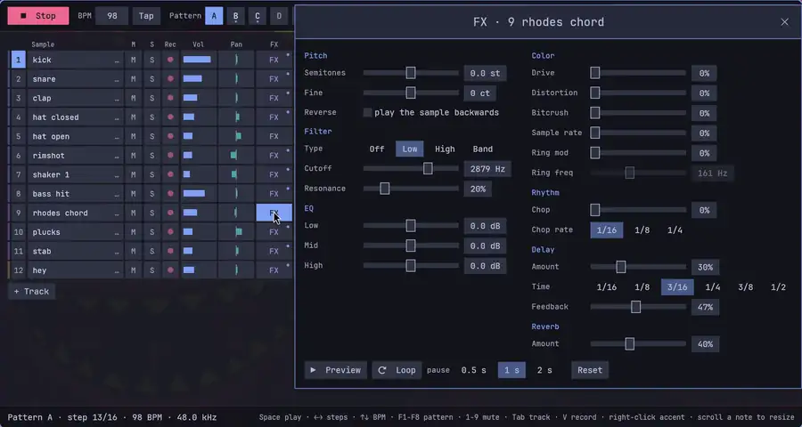
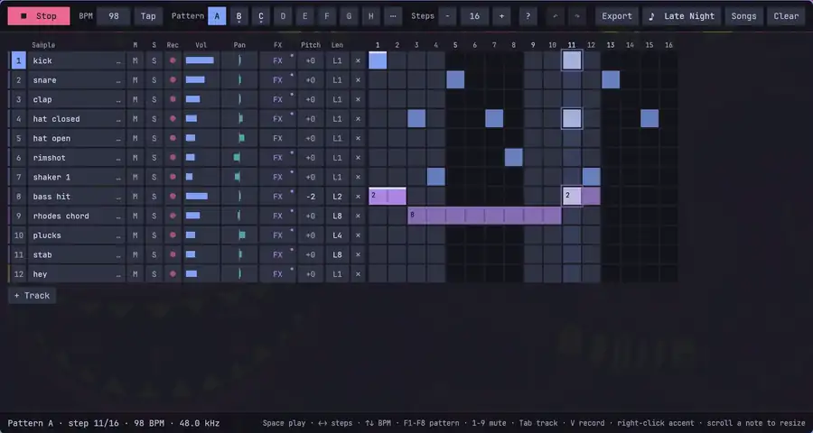
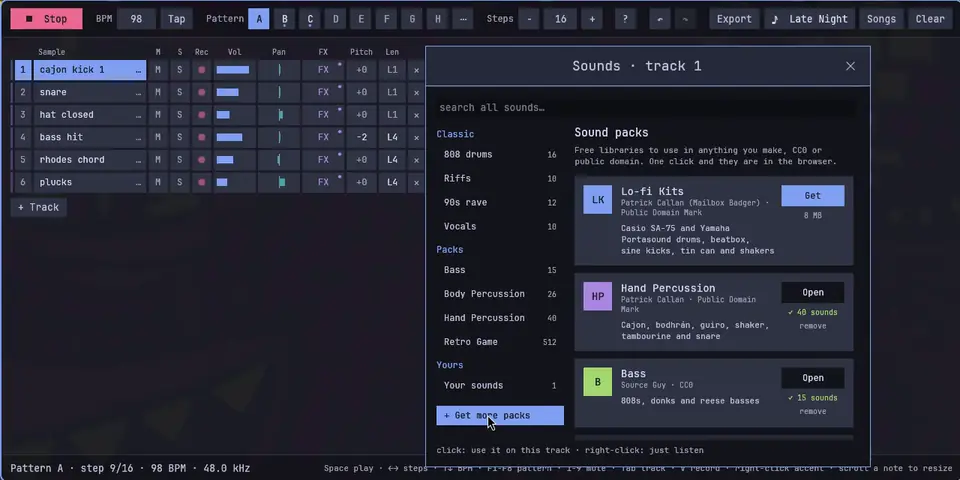
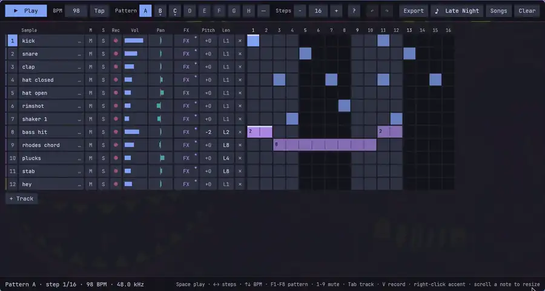
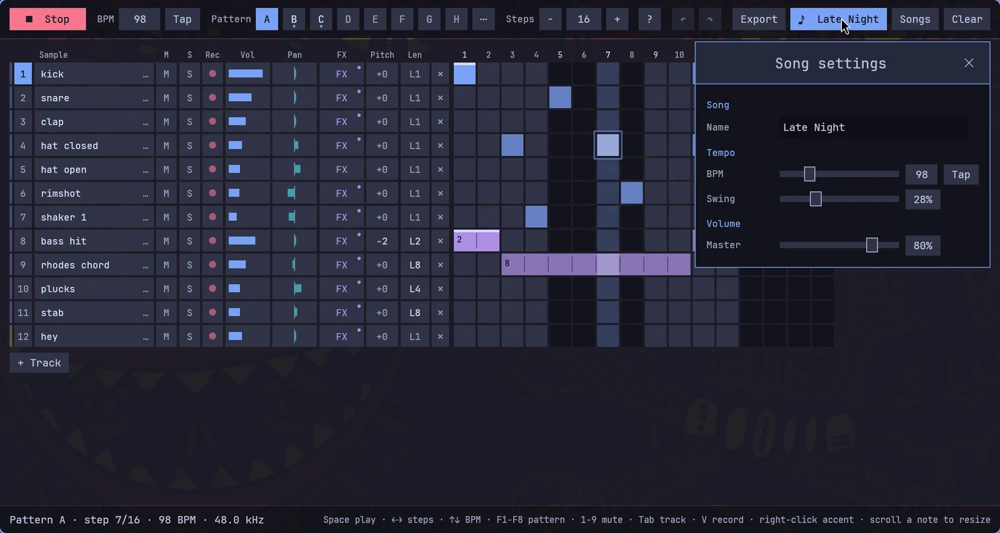
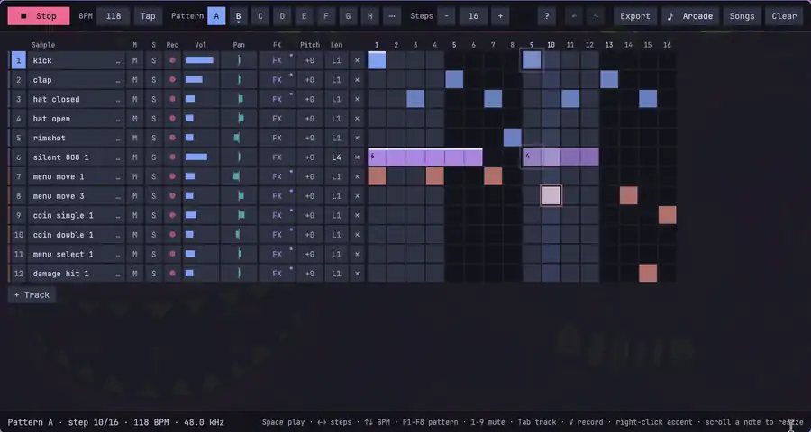
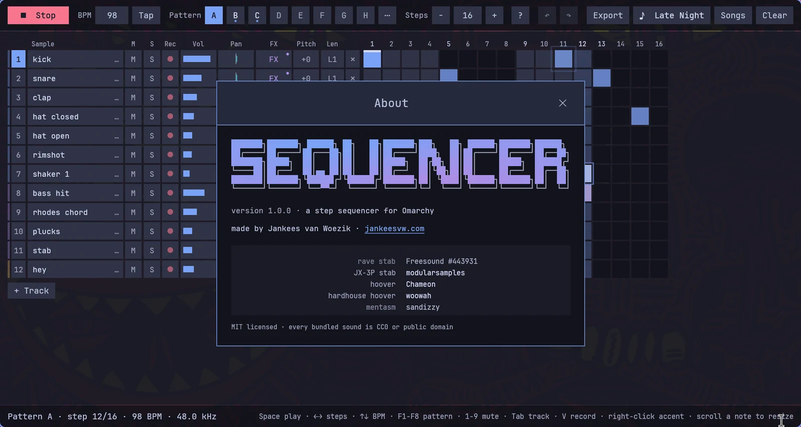

# Sequencer

A step sequencer for [Omarchy](https://omarchy.org). Click a beat together on the grid, stretch notes across as many steps as you like, give every track its own effects, and record your own sounds from the microphone. It comes with a TR-808 kit, riffs, 90s rave stabs and vocals, and one click gets you more: free sound packs for lo-fi drums, hand percussion, basses, body percussion and 8-bit blips.


Open it, press **Space**, and the groove starts. Everything you change is heard on the next step, and every song saves itself while you work. When you like it, **Export** writes it to a WAV. The whole app wears your Omarchy theme and follows it when you switch.

**▶ [Watch the 80 second trailer, with sound](media/trailer.mp4)**

Built for Omarchy on Hyprland (Rust, with egui for the interface and cpal for audio through PipeWire).

## Install

```bash
curl -fsSL https://raw.githubusercontent.com/jankeesvw/omarchy-sequencer/main/install.sh | bash
```

This downloads the latest release and puts `omarchy-sequencer` in `~/.local/bin`, with a launcher entry and an icon, so **Sequencer** shows up under Super + Space. [install.sh](install.sh) is short, so read it first if you like. Prefer to build it yourself? See [Build from source](#build-from-source).

## What it does

### Plays a groove in eight patterns

The letters A to H are eight patterns, each with its own notes and length. Pick another one while the song plays and it waits for the end of the bar, so the switch always lands on time. Shift-click a letter to copy the current pattern into it as a starting point, and **Clear** wipes the one you are on (Ctrl+Z brings it back).



▶ [The same with sound](media/groove.mp4)

### Lets you draw notes as long as you want

Click or drag across the grid to draw, click a note to erase it, and right-click for an accent. Every track has a length button (L1, L2, L4, L8 or L16) for the notes you draw next, so a bass line or a chord can hold for a beat, a bar or anything in between, and it sounds exactly as long as it looks. Scroll over a note to make it longer or shorter. Every cell flashes and sends out a ring when it plays.



▶ [The same with sound](media/draw.mp4)

The cells are always square and the track settings always the same size: when a pattern of 32 or 64 steps doesn't fit, the grid scrolls sideways and the tracks stay where they are.



### Gives every track its own effects

**FX** on a track opens its effects: pitch, fine tuning and reverse; a low, high or band pass filter; a three band EQ; drive, distortion, bitcrush, sample rate reduction and a ring modulator; a chop that gates the track in time with the song; and a delay and reverb. **Loop** plays the sample over and over with a short pause, so you can turn the knobs and hear what they do.



▶ [The same with sound](media/fx.mp4)


### Has a sound for everything

Click a track's sound to open the browser. The built-in library has a TR-808 kit, riffs and stabs, real 90s rave sounds (a Roland JX-3P stab, hoovers, an M1 organ, an orchestra hit, acid lines, rave loops) and vocals from "Everybody" to "Access Granted". Search finds a sound across all of them. Click to use it on the track, right-click to only listen.



▶ [The same with sound](media/sounds.mp4)

### Downloads free sound packs

**Get more packs** lists free sample libraries, all CC0 or public domain, so what you make with them is yours. One click downloads a pack, and its sounds are in the browser right away.



| Pack | What is in it | Licence | Size |
|---|---|---|---|
| Lo-fi Kits | Casio SA-75 and Yamaha Portasound drums, beatbox, sine kicks, tin can, shakers | Public Domain Mark | 8 MB |
| Hand Percussion | Cajon, bodhrán, guiro, shaker, tambourine, snare | Public Domain Mark | 2 MB |
| Bass | 808s, donks and reese basses | CC0 | 6 MB |
| Body Percussion | Claps, snaps, chest and belly slaps, stomps | CC0 | 61 MB |
| Retro Game | 512 8-bit blips, jumps, lasers, explosions and voices | CC0 | 21 MB |
| Found Percussion | Percussion recorded from everyday objects | Public Domain Mark | 88 MB |

### Records your own sounds

Hold the red button on a track, or hold **V** for the selected track, and make a sound. It works like [Voxtype](https://github.com/peteonrails/voxtype): the microphone is only open while you hold. When you let go, the silence is trimmed, the level is evened out and the recording goes straight onto the track. Recordings are kept as `rec_01.wav`, `rec_02.wav` and so on, next to any `.wav` files of your own.



▶ [The same with sound](media/record.mp4)

### Keeps your songs

Every song is a file in `~/Music/Sequencer` that saves itself a few seconds after every change. **Songs** lists them with their tempo and when you last worked on them, starts a new one (empty, or from the Demo, Rave or Late Night preset) and deletes the ones you don't need. The next start opens the song you had open. Click the song's name for its settings: the name, tempo with tap tempo, swing and master volume.




### Wears your Omarchy theme

The app reads the palette of the current theme (`colors.toml`) and uses your monospace font. Every kind of sound gets its own colour from the theme: drums the accent, riffs and basses magenta, rave green, vocals yellow, other pack sounds orange and your recordings cyan. Switch themes while it is open and it follows. Themes that are too subtle for small text or empty cells are nudged just enough to stay readable, so it works on every Omarchy theme, light ones included.



▶ [The same with sound](media/themes.mp4)


### Has an about box like software used to

The **?** in the toolbar opens it: an ASCII logo with a colour wave running through it, and credits rolling by for everyone whose sounds are in here.



## Keys

| Key | What it does |
|---|---|
| `Space` | Play or stop |
| `←` `→` | Fewer or more steps |
| `↑` `↓` | Tempo down or up |
| `T` | Tap the tempo |
| `F1` to `F8` | Pattern A to H, with `Shift` to copy the current pattern there |
| `1` to `9` | Mute track 1 to 9 |
| `Tab`, `Shift+Tab` | Select the next or previous track |
| `V` (hold) | Record into the selected track |
| `R`, `C`, `N` | Random pattern, clear the pattern, add a track |
| `Ctrl+Z`, `Ctrl+Shift+Z` | Undo, redo |
| `Ctrl+N`, `Ctrl+O` | New song, open the songs window |
| `Ctrl+S`, `Ctrl+E` | Save now, export a WAV |

With the mouse: right-click a cell for an accent, scroll over a note to change its length, and scroll over a volume or pan bar to nudge it.

## Command line

| Command | What it does |
|---|---|
| `omarchy-sequencer` | Open the song you had open last |
| `omarchy-sequencer --play` | Start playing right away |
| `omarchy-sequencer --preset demo`, `rave`, `late-night` | Start a new song from a preset |
| `omarchy-sequencer --install-pack <pack>` | Download a sound pack; without a name it lists them |
| `omarchy-sequencer --about` | Open with the about box |

## What it writes to disk

| Path | What |
|---|---|
| `~/Music/Sequencer/<song>.json` | Your songs |
| `~/Music/sequencer-<pattern>-<bpm>bpm-<nn>.wav` | Exports: the current pattern four times, with the tail of the effects |
| `~/.local/share/omarchy-sequencer/samples/` | Your recordings and your own `.wav` files |
| `~/.local/share/omarchy-sequencer/packs/<pack>/` | Downloaded sound packs, each with a `pack.json` saying where it came from |
| `~/.config/omarchy-sequencer/state.json` | Which song was open last |

## How it works

The audio runs in its own thread through cpal, which on Omarchy goes through PipeWire. The engine counts samples, not milliseconds, so the timing is exact, and swing moves every other step. Every track plays into its own bus, with one voice at a time so a hi-hat or a riff cuts off the previous one cleanly, and the bus goes through that track's effects and its own delay before the mix. A long note is gated: it fades out after as many steps as it spans.

The interface is egui, repainting 60 times a second while playing and a few times a second when not. It doesn't wait for vsync, because on Wayland that stalls the app while its window is on another workspace, and Hyprland then reports it as not responding.

Sound packs are downloaded with `curl` and unpacked with `bsdtar`, both part of every Arch install. The bundled samples are embedded in the binary, so a fresh install has sound without any downloads.

## Requirements

Omarchy, or another Wayland desktop with PipeWire. `curl` and `bsdtar` for sound packs and `fc-match` (fontconfig) for the font, all standard on Arch. A Rust toolchain if you build it yourself.

## Build from source

```bash
git clone https://github.com/jankeesvw/omarchy-sequencer.git
cd omarchy-sequencer
./install.sh
```

From a checkout, `install.sh` builds a release with cargo and installs it like the release does. `cargo test` runs the tests, including one that checks every Omarchy theme on your machine for contrast.

## Samples and credits

All bundled samples are CC0 or public domain, converted to 44.1 kHz mono and embedded in the binary.

- **Drums:** the Roland TR-808 Sound Sample Set by Michael Fischer (1994), via [tidalcycles/sounds-tr808-fischer](https://github.com/tidalcycles/sounds-tr808-fischer).
- **Riffs and stabs:** "2HTC Samples Vol 4 Addendum" by Ben Burnes (Abstraction Music), via [lavenderdotpet/CC0-Public-Domain-Sounds](https://github.com/lavenderdotpet/CC0-Public-Domain-Sounds).
- **90s rave:** real recordings from Freesound: rave stab ([443931](https://freesound.org/s/443931/)), Roland JX-3P stab by modularsamples ([307131](https://freesound.org/s/307131/)), hoover by Chameon ([399542](https://freesound.org/s/399542/)), hardhouse hoover by woowah ([11512](https://freesound.org/s/11512/)), mentasm by sandizzy ([25393](https://freesound.org/s/25393/)), M1 organ by Cloud-10 ([680995](https://freesound.org/s/680995/)), orchestra hit by BigDumbWeirdo ([90741](https://freesound.org/s/90741/)), acid line by makenoisemusic ([402949](https://freesound.org/s/402949/)), acid bass by evanjones4 ([243999](https://freesound.org/s/243999/)), house chords by Slanted ([510229](https://freesound.org/s/510229/)), and rave loops by Alastair_Pursloe ([183441](https://freesound.org/s/183441/)) and GENERALMiDiGUy ([490703](https://freesound.org/s/490703/)).
- **Vocals:** dance shouts, soulful house vocals and computer voices from the [Producer Space CC0 library](https://archive.org/details/producer-space-cc0-sample-library).
- **Sound packs:** Patrick Callan ([Lo-fi Kits](https://archive.org/details/HeatDish), [Hand Percussion](https://archive.org/details/public_domain_drum_samples_pack_for_upcoming_2026_album)), Source Guy ([Bass](https://archive.org/details/source-guy-bass-collection)), Karoryfer Samples ([Body Percussion](https://github.com/sfzinstruments/body_percussion)), Juhani Junkala ([Retro Game](https://opengameart.org/content/512-sound-effects-8-bit-style)) and the Field Recording Working Group ([Found Percussion](https://archive.org/details/MicroblocksVol.1ASoundscapePercussionSamplePack)).

The songs in the videos (Late Night, Arcade, Body Jam and Rave) were made in Sequencer itself.

## License

MIT for the code, by [Jankees van Woezik](https://jankeesvw.com). The samples are CC0 or public domain, see above.
