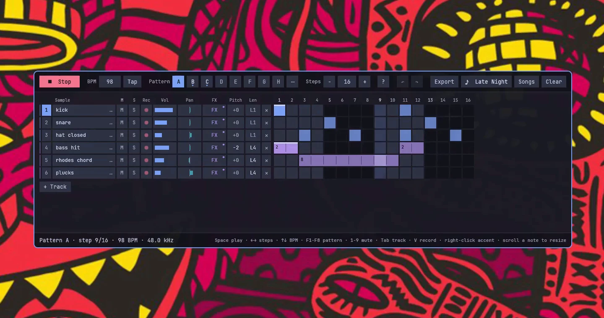
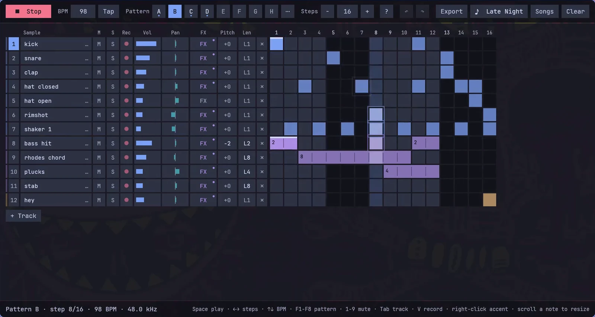
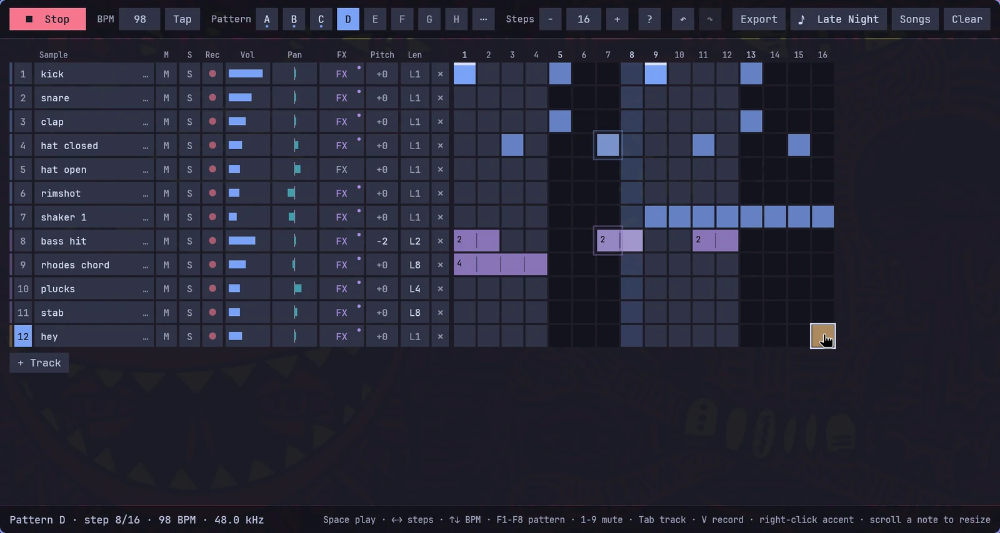
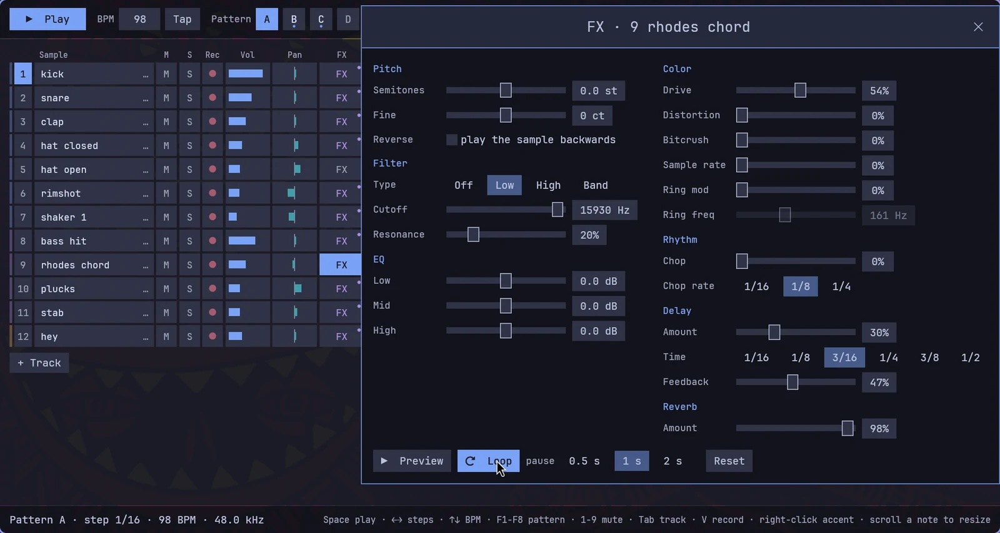
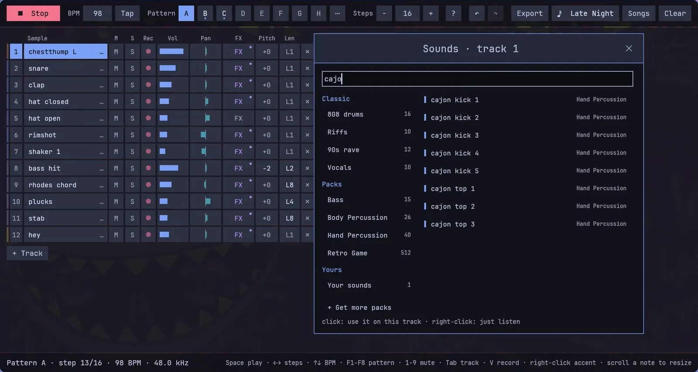
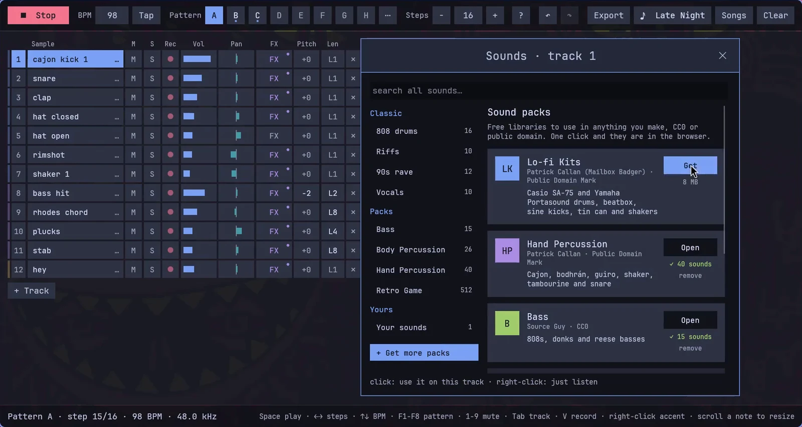
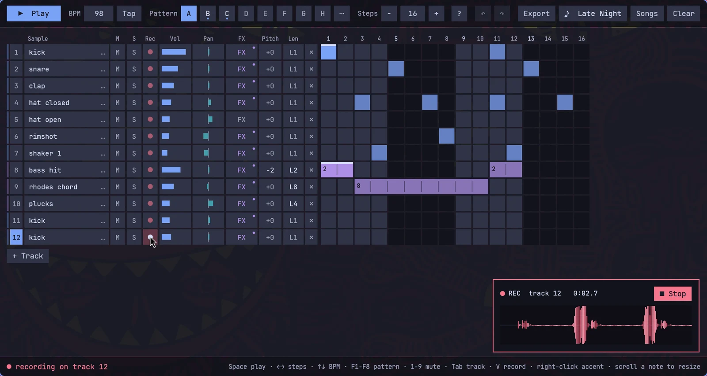
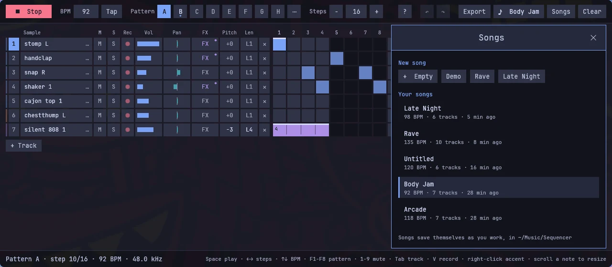
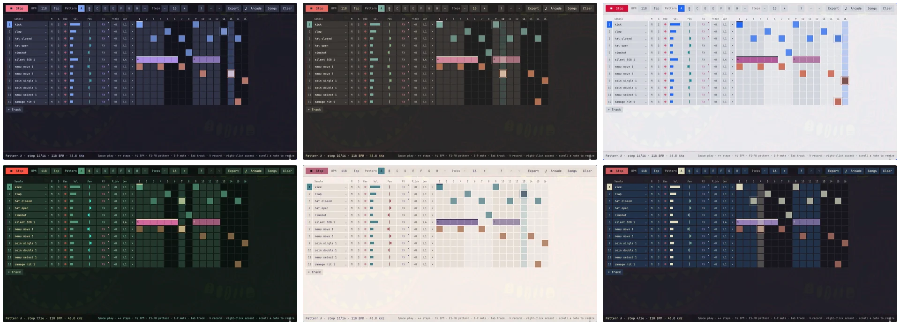

# Sequencer

A step sequencer for [Omarchy](https://omarchy.org). Click a beat together, stretch notes across as many steps as you like, give every track its own effects, and record your own sounds. It comes with a TR-808 kit, riffs, 90s rave sounds and vocals, and free sound packs are one click away.



**▶ [Watch the one minute trailer, with sound](media/trailer.mp4)**

Built for Omarchy on Hyprland, in Rust.

## Install

```bash
curl -fsSL https://raw.githubusercontent.com/jankeesvw/omarchy-sequencer/main/install.sh | bash
```

Then open **Sequencer** from the launcher (Super + Space) and press **Space**.

## What it does

### Plays a groove in eight patterns

The letters A to H are eight patterns. Pick another one while the song plays and it switches at the end of the bar.



### Lets notes last as long as you want

Click or drag to draw, right-click for an accent. A note can span 1 to 16 steps, so a bass line or a chord holds exactly as long as you draw it. Scroll over a note to change its length.



### Gives every track its own effects

**FX** on a track opens a filter, EQ, drive, distortion, bitcrush, a ring modulator, a chop in time with the song, delay, reverb, pitch and reverse. **Loop** keeps playing the sound so you hear every change.



### Has a sound for everything

Click a track's sound to open the browser: a TR-808 kit, riffs, real 90s rave sounds like hoovers, an M1 organ and a JX-3P stab, and vocals. Search finds a sound in everything you have.



### Downloads free sound packs

**Get more packs** downloads free sample libraries with one click. They are all CC0 or public domain, so what you make with them is yours.



| Pack | What is in it | Size |
|---|---|---|
| Lo-fi Kits | Casio and Yamaha toy keyboard drums, beatbox, sine kicks, shakers | 8 MB |
| Hand Percussion | Cajon, bodhrán, guiro, shaker, tambourine | 2 MB |
| Bass | 808s, donks and reese basses | 6 MB |
| Body Percussion | Claps, snaps, slaps and stomps | 61 MB |
| Retro Game | 512 8-bit blips, jumps, lasers and explosions | 21 MB |
| Found Percussion | Percussion recorded from everyday objects | 88 MB |

### Records your own sounds

Click the red button on a track, or tap **V**, and make a sound; click again to stop. Or hold it and let go when you are done. The recording goes straight onto the track, ready to play.



### Keeps your songs

Songs save themselves while you work, in `~/Music/Sequencer`. **Songs** opens, starts and deletes them, and **Export** writes the current pattern to a WAV.



### Shares your songs

**Songs → Share** puts a song on the community site, where others can listen to it, vote for it, and open it in the app. `omarchy-sequencer --open <song url>` opens a shared song, and installs any sound packs it needs.

### Wears your Omarchy theme

It takes the colours and font of your theme, light ones included, and follows along when you switch.



## Keys

| Key | What it does |
|---|---|
| `Space` | Play or stop |
| `←` `→` | Fewer or more steps |
| `↑` `↓`, `T` | Tempo down or up, tap the tempo |
| `F1` to `F8` | Pattern A to H, with `Shift` to copy the current pattern there |
| `1` to `9` | Mute track 1 to 9 |
| `Tab` | Select the next track |
| `V` | Record into the selected track: tap to start and stop, or hold |
| `R`, `C`, `N` | Random pattern, clear the pattern, add a track |
| `Ctrl+Z`, `Ctrl+Shift+Z` | Undo, redo |
| `Ctrl+N`, `Ctrl+O` | New song, open the songs window |
| `Ctrl+E` | Export a WAV |

## Command line

| Command | What it does |
|---|---|
| `omarchy-sequencer --play` | Start playing right away |
| `omarchy-sequencer --preset demo`, `rave`, `late-night` | Start a new song from a preset |
| `omarchy-sequencer --open <song url>` | Open a song from the community site, with the packs it needs |
| `omarchy-sequencer --install-pack <pack>` | Download a sound pack; without a name it lists them |

## Files

| Path | What |
|---|---|
| `~/Music/Sequencer/` | Your songs, and your exports next to it in `~/Music` |
| `~/.local/share/omarchy-sequencer/samples/` | Your recordings; drop your own `.wav` files here too |
| `~/.local/share/omarchy-sequencer/packs/` | Downloaded sound packs |

## Build from source

```bash
git clone https://github.com/jankeesvw/omarchy-sequencer.git
cd omarchy-sequencer
./install.sh
```

From a checkout, `install.sh` builds with cargo. Sound packs need `curl` and `bsdtar`, both standard on Arch.

## Samples and credits

All bundled samples are CC0 or public domain.

- **Drums:** the Roland TR-808 Sound Sample Set by Michael Fischer (1994), via [tidalcycles/sounds-tr808-fischer](https://github.com/tidalcycles/sounds-tr808-fischer).
- **Riffs and stabs:** "2HTC Samples Vol 4 Addendum" by Ben Burnes (Abstraction Music), via [lavenderdotpet/CC0-Public-Domain-Sounds](https://github.com/lavenderdotpet/CC0-Public-Domain-Sounds).
- **90s rave:** recordings from Freesound: rave stab ([443931](https://freesound.org/s/443931/)), Roland JX-3P stab by modularsamples ([307131](https://freesound.org/s/307131/)), hoover by Chameon ([399542](https://freesound.org/s/399542/)), hardhouse hoover by woowah ([11512](https://freesound.org/s/11512/)), mentasm by sandizzy ([25393](https://freesound.org/s/25393/)), M1 organ by Cloud-10 ([680995](https://freesound.org/s/680995/)), orchestra hit by BigDumbWeirdo ([90741](https://freesound.org/s/90741/)), acid line by makenoisemusic ([402949](https://freesound.org/s/402949/)), acid bass by evanjones4 ([243999](https://freesound.org/s/243999/)), house chords by Slanted ([510229](https://freesound.org/s/510229/)), and rave loops by Alastair_Pursloe ([183441](https://freesound.org/s/183441/)) and GENERALMiDiGUy ([490703](https://freesound.org/s/490703/)).
- **Vocals:** dance shouts, house vocals and computer voices from the [Producer Space CC0 library](https://archive.org/details/producer-space-cc0-sample-library).
- **Sound packs:** Patrick Callan ([Lo-fi Kits](https://archive.org/details/HeatDish), [Hand Percussion](https://archive.org/details/public_domain_drum_samples_pack_for_upcoming_2026_album)), Source Guy ([Bass](https://archive.org/details/source-guy-bass-collection)), Karoryfer Samples ([Body Percussion](https://github.com/sfzinstruments/body_percussion)), Juhani Junkala ([Retro Game](https://opengameart.org/content/512-sound-effects-8-bit-style)) and the Field Recording Working Group ([Found Percussion](https://archive.org/details/MicroblocksVol.1ASoundscapePercussionSamplePack)).

## License

MIT, by [Jankees van Woezik](https://jankeesvw.com). The samples are CC0 or public domain, see above.
